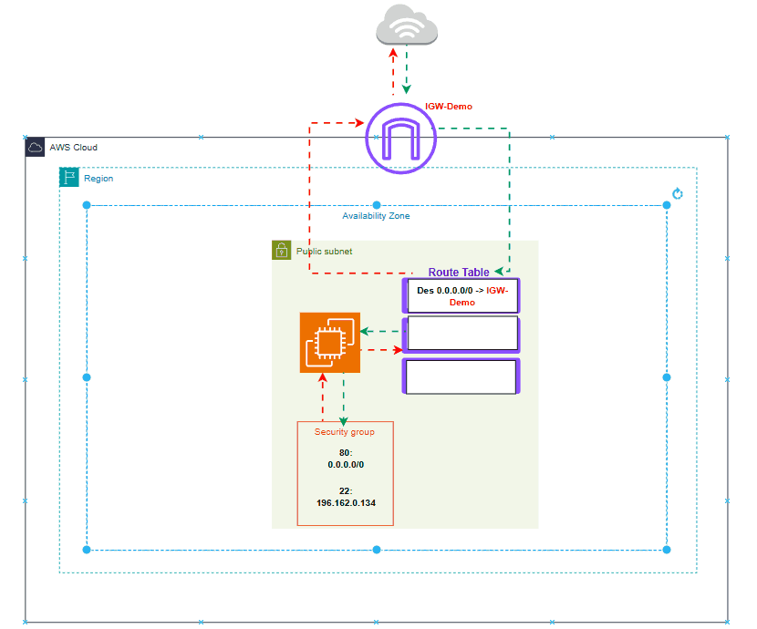

# ROUTE TABLE 

A Route Table in Amazon Virtual Private Cloud is a set of rules that determines where network traffic from a subnet should go. It's usually assosiate or attach to a `Public Subnet`

`Every route contains two key parts:`

- *Destination*: The IP range the rule applies to  **0.0.0.0/0**
- *Target*: The next hop where the traffic should be sent **Internet Gateway**
- `0.0.0.0/0 → Internet Gateway`: If traffic is going to any IP address outside the VPC, send it to the Internet Gateway.

---

# Security Group

A Security Group acts like a firewall for resources like Amazon EC.

It controls:

- Inbound traffic (who can access the instance)
    - Allow HTTP (80) from 0.0.0.0/0
    - Allow SSH (22) from your IP

- Outbound traffic (where the instance can send traffic)
  - Allow all traffic

## Traffic Flow from Public subnet to the Internet

   

## Traffic Flow from Multiple Public subnets to the Internet

User Request
   ↓
Internet
   ↓
Internet Gateway
   ↓
Application Load Balancer (port 80)
ALB security Group
Inbound
HTTP (80) from 0.0.0.0/0
   ↓
Target Group
Target type: Instances
Protocol: HTTP
Port: 3033
VPC: your-vpc
   ↓
EC2 Instance (API on port 3033)
EC2 Security Group
Inbound
TCP 3033 from ALB Security Group

- VPC
- IGW
- 2 public subnets
- 2 private subnets
- Nat gateway
- 1 public subnet route table, routed to IGW and associated to public subnets
- 1 private subnet route table,  routed to NAT and associated to private subnets
- 2 ec2 instance in each private subnets
- SG for ec2
- EC2 Security Group
   Inbound
   TCP 3033
   Source: ALB Security Group
   Outbound
   All traffic (default)

- Create ALB
- ALB Security Group

   Inbound

   HTTP 80
   Source: 0.0.0.0/0

   Outbound
   TCP 3033
   Destination: EC2 Security Group

- Created Target Group for the 2 EC2 instances
- Added This target group as the target group for our ALB

----
USer Data
#!/bin/bash

# Update packages
apt-get update -y
apt-get upgrade -y

# Install Docker
apt-get install -y docker.io

# Start and enable Docker
systemctl start docker
systemctl enable docker

# Pull your Docker image
docker pull tayokanch/weather-forecast-api-v1

# Run the container
docker run -d \
  -p 3033:3033 \
  -e API_KEY=your_real_api_key_here \
  --name weather-api \
  tayokanch/weather-forecast-api-v1